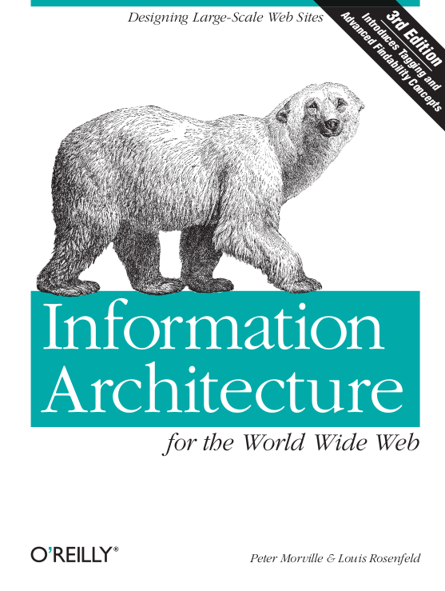
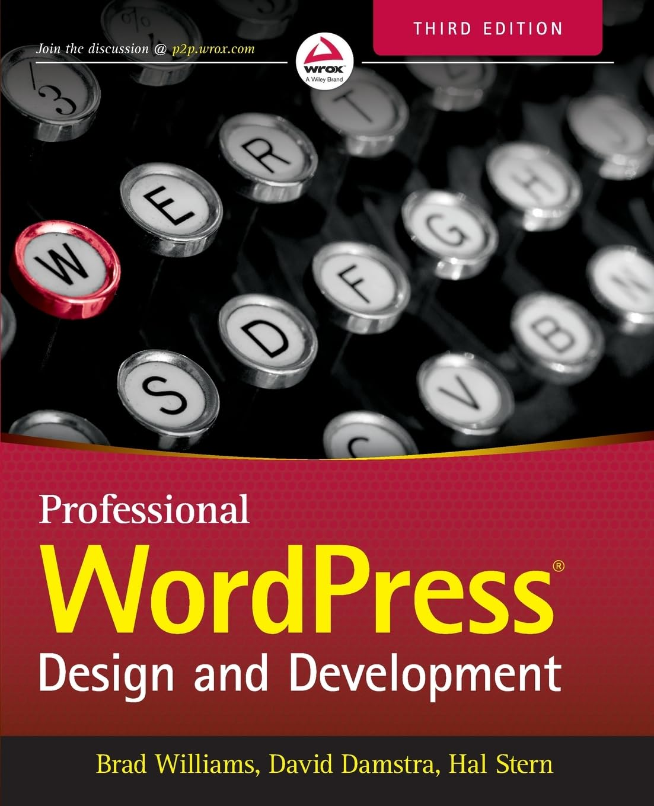
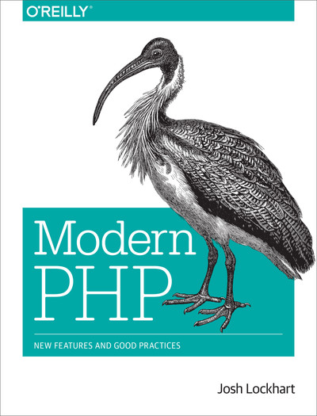

# WordPress - PHP

- [WordPress - PHP](#wordpress---php)
  - [Kit de développement](#kit-de-développement)
  - [Démos](#démos)
  - [Liens utiles](#liens-utiles)
    - [Création de thèmes](#création-de-thèmes)
    - [Taxonomies](#taxonomies)
    - [Gestion des permaliens](#gestion-des-permaliens)
    - [PHP](#php)
  - [Bibliographie pour aller plus loin](#bibliographie-pour-aller-plus-loin)
    - [CMS et architecture de l'information](#cms-et-architecture-de-linformation)
    - [WordPress](#wordpress)
    - [PHP](#php-1)

## Kit de développement

[Accéder au kit](./kit-dev/)

## Démos

## Liens utiles

- [Make Wordpress](https://make.wordpress.org/), hub centralisé officiel des ressources pour les développeur·ses Wordpress;

### Création de thèmes

- [Theme Handbook](https://developer.wordpress.org/themes/), guides officiels de WordPress pour créer des thèmes classiques et/ou basés sur des thèmes;

### Taxonomies

- [WordPress Taxonomies: The Ultimate Guide](https://ithemes.com/blog/wordpress-taxonomies), guide officiel;

### Gestion des permaliens

- [WordPress Permalinks: The Essential Guide](https://ithemes.com/blog/wordpress-permalinks), guide officiel;

### PHP

- [Veille PHP](https://github.com/paul-schuhm/veille-php), un ensemble de ressources et d'articles pour faire de la veille sur l'écosystème PHP 

## Bibliographie pour aller plus loin

### CMS et architecture de l'information

-  [Information Architecture for the World Wide Web 3rd Edition](https://www.oreilly.com/library/view/information-architecture-for/0596527349/), de Peter Morville et Louis Rosenfeld, publié chez O'Reilly Media, 2006; **LP++**

### WordPress

- [Professional WordPress: Design and Development, 3rd Edition](https://www.amazon.com/Professional-WordPress-Development-Brad-Williams/dp/1118987241) de Brad Williams et David Damstra, publié aux éditions Wrox (Wiley), 2015; **LP+**
- [Professional WordPress Plugin Development, 2nd edition](https://www.amazon.com/Professional-WordPress-Plugin-Development-2nd/dp/1119666945) de Brad Williams et Justin Taldock, publié aux éditions Wrox (Wiley), 2020;

### PHP

- [Modern PHP: new features and good practices](https://www.oreilly.com/library/view/modern-php/9781491905173/), Josh Lochart, Edition O'REILLY, 2015. Excellent livre présentant la pratique du PHP *moderne* (>= PHP 5) **LP++**;
- [Essential PHP Security](https://www.oreilly.com/library/view/essential-php-security/059600656X/), Chris Shiflett, O'Reilly Media, Inc., 2005. Excellente introduction à la sécurité des applications web et des applications web PHP en particulier, **concis** (moins de 100 pages !). **LP+**;
